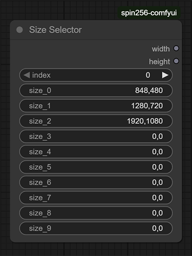
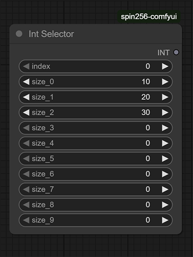
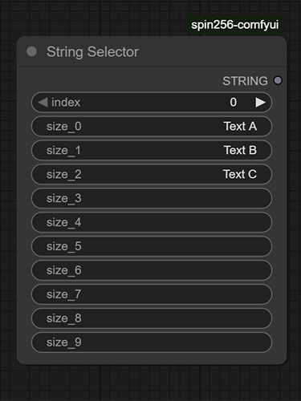

# Spin256-comfyui for ComfyUI

Nodes to enable easy selection of image/video sizes (width/height) and int/string selectors

# Installation
1. Clone this repo into `custom_nodes` folder.

### Size Selector

Ten String fields in the format "width,height" outputting two INT nodes

### Int Selector

Ten INT fields outputting INT node

### String Selector

Ten String fields outputting INT String

